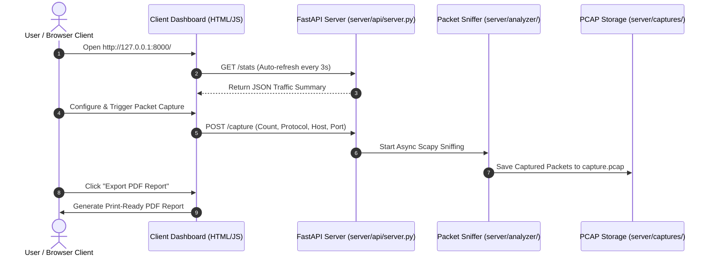

# NetworkTrafficAnalyzer 🛡️📡

> **Real-Time Network Packet Sniffer, Traffic Analytics Engine & Wireshark-Style Web Dashboard**

NetworkTrafficAnalyzer is a modular network traffic analysis suite built with Python, Scapy, FastAPI, and vanilla HTML5/CSS3. It enables network administrators, security researchers, and developers to capture live network packets, analyze transport-layer metrics, track active TCP connection streams, save/read standard `.pcap` files, and export formatted PDF traffic reports.

---

## 🌟 Key Features

- **⚡ Real-Time Packet Sniffing**: Sniff live network traffic or analyze existing `.pcap` capture files using Scapy.
- **📊 Wireshark Light Web Dashboard**: Clean, responsive frontend inspired by Wireshark packet highlight color palettes (TCP, UDP, ICMP, OTHER).
- **📄 One-Click PDF Report Export**: Export live traffic analytics, protocol shares, and connection streams as print-ready PDF audit reports (see sample in [`report file/`](file:///e:/12_month_plan/python-networking-lab/NetworkTrafficAnalyzer/report%20file/Network%20Traffic%20Analyzer%20_%20Dashboard.pdf)).
- **📁 PCAP Storage & Download**: Save captures to standard `.pcap` files and download them directly from the web interface for external analysis in Wireshark.
- **🚩 TCP Flags Analytics**: Track distribution of `SYN`, `ACK`, `FIN`, `RST`, and `PSH` flags to detect port scans or abnormal handshakes.
- **🌐 Active Connection Stream Tracking**: Bi-directional IP:Port stream mapping with packet and byte volume counters.
- **🔌 REST API & Swagger UI**: Fully documented FastAPI endpoints with CORS middleware enabled for decoupled client/server deployments.

---

## 🏗️ Project Architecture



---

## 📁 Directory Structure

```
NetworkTrafficAnalyzer/
│
├── client/                     # [Frontend Client Dashboard]
│   ├── index.html             # HTML5 Dashboard layout
│   ├── styles.css             # Wireshark light theme & print styles
│   └── app.js                 # REST API client & PDF export handler
│
├── server/                     # [Backend Server & Sniffer]
│   ├── main.py                # Server CLI & API launcher
│   ├── requirements.txt       # Python dependencies (scapy, fastapi, uvicorn)
│   │
│   ├── analyzer/              # Core Traffic Analysis Package
│   │   ├── __init__.py        # Package exports
│   │   ├── capture.py         # PacketCapture & PCAP writer
│   │   ├── filters.py         # PacketFilter (Protocol, Host, Port)
│   │   └── statistics.py      # TrafficStatistics & stream tracker
│   │
│   ├── api/                   # REST API Module
│   │   └── server.py          # FastAPI application & file download endpoints
│   │
│   └── captures/              # Storage directory for .pcap files
│       └── capture.pcap       # Generated capture file
│
├── report file/               # Sample PDF Audit Reports
│   └── Network Traffic Analyzer _ Dashboard.pdf
│
└── README.md                  # Project documentation
```

---

## 🚀 Quick Start Guide

### Step 1: Install Dependencies

Ensure Python 3.10+ is installed, navigate to the `server/` directory, and install dependencies:

```bash
cd server
pip install -r requirements.txt
```

### Step 2: Launch the API Server & Dashboard

Start the FastAPI server (which automatically hosts the `client/` dashboard):

```bash
python main.py --api
```

### Step 3: Open the Dashboard

Open your web browser and navigate to:
👉 **[http://127.0.0.1:8000/](http://127.0.0.1:8000/)**

Swagger Interactive API Documentation is available at **[http://127.0.0.1:8000/docs](http://127.0.0.1:8000/docs)**.

---

## 🌐 REST API Endpoints

| Method | Endpoint | Description |
| :--- | :--- | :--- |
| `GET` | `/health` | API health check status |
| `GET` | `/stats` | Retrieve current traffic statistics summary (JSON) |
| `POST` | `/capture` | Trigger an asynchronous packet capture session |
| `GET` | `/captures` | List all saved `.pcap` capture files |
| `GET` | `/captures/download/{filename}` | Download a specific `.pcap` capture file |

---

## 💻 CLI Commands (Command Line Usage)

You can also run packet captures directly from the terminal via `server/main.py`:

```bash
# Basic live capture (100 packets)
python server/main.py

# Filter TCP traffic on port 80
python server/main.py --protocol tcp --port 80

# Filter traffic for a specific host IP
python server/main.py --host 192.168.1.1 --count 50

# Analyze an existing offline PCAP capture file
python server/main.py --pcap captures/capture.pcap
```

---

## 📄 PDF Export & Reports

The project supports exporting comprehensive PDF traffic reports directly from the web dashboard:
- Click the **"Export PDF Report"** button in the header bar.
- Uses `@media print` CSS rules to format KPI cards, protocol breakdown, TCP flag distribution, and active connection stream tables into an audit-ready A4 document.
- Refer to [`report file/Network Traffic Analyzer _ Dashboard.pdf`](file:///e:/12_month_plan/python-networking-lab/NetworkTrafficAnalyzer/report%20file/Network%20Traffic%20Analyzer%20_%20Dashboard.pdf) for a sample exported report.

---

## 🔒 Deployment Notes

- **Live Packet Sniffing**: Capturing raw network interface sockets requires **Administrator privileges** (Windows) or `root`/`CAP_NET_ADMIN` (Linux/Docker).
- **Decoupled Hosting**: The `client/` directory can be hosted on static platforms (Netlify, Vercel, S3) while `server/` runs on a Linux VPS. Enable cross-origin requests by configuring `API_BASE` in `client/app.js`.
